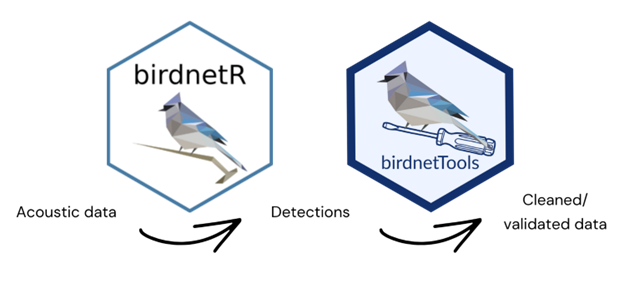

.. _birdnetR: https://birdnet-team.github.io/birdnetR/
.. _birdnetTools: https://birdnet-team.github.io/birdnetTools/

.. |birdnetR| replace:: **birdnetR**
.. |birdnetTools| replace:: **birdnetTools**

BirdNET in R
============

We do also provide a BirdNET package for R, which allows you to analyze audio recordings directly in R.

| 

|birdnetR|_ is geared towards providing a robust workflow for ecological data analysis in bioacoustic projects. 
While it covers essential functionalities, it doesn't include all the features found in BirdNET-Analyzer. 
Some features might only be available in the BirdNET Analyzer and not in this package.

|birdnetTools|_ is designed to streamline the post-processing and validation of output from BirdNET.
It includes functions for filtering detections by species, confidence, and date/time; visualizing temporal patterns;
and validating detections with an interactive Shiny app to support threshold-setting workflows. 

.. note::
    Please note that both packages are under active development, so you might encounter changes that could affect your current workflow.
    We recommend checking for updates regularly.

See our website for more information: 

`https://birdnet-team.github.io/birdnetR/index.html <https://birdnet-team.github.io/birdnetR/index.html>`_